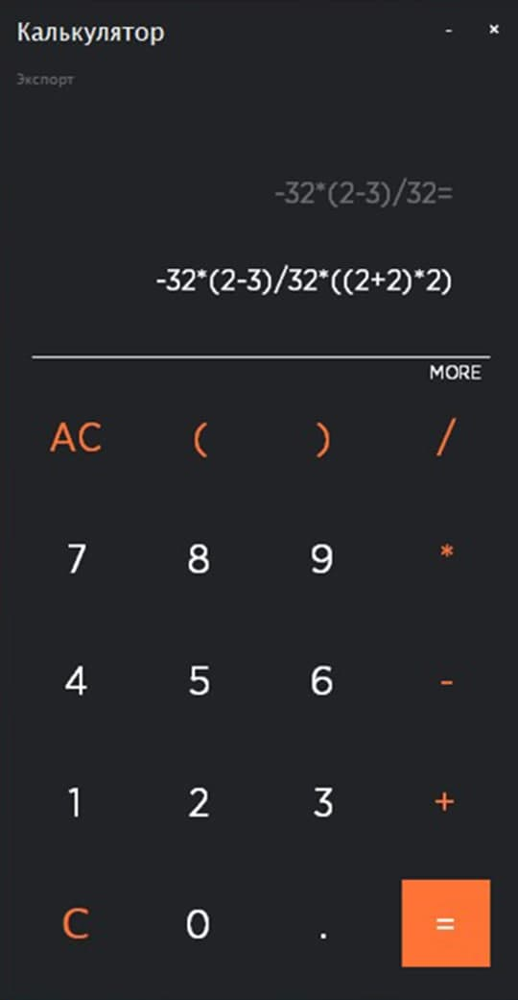
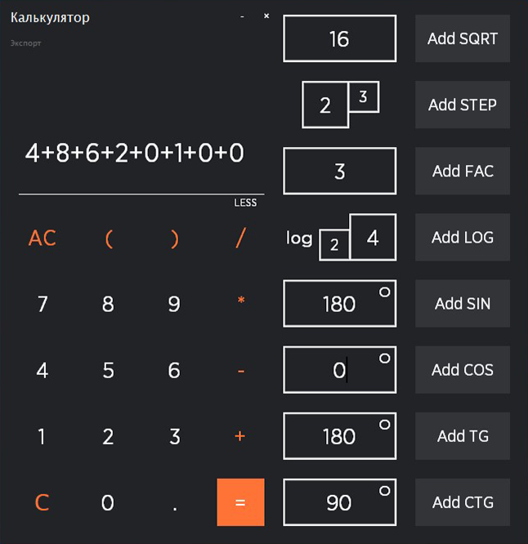

# Tkinter Calculator

Студент КПИ, если ты используешь мою работу для своей ДКР, то хотя бы закинь 1$ мне на патреон https://www.patreon.com/bob_volskiy

# UI look: 

# What it can do?: 
  - 
  - 
  - 
  - 

# Requirements: 
  - Montserrat Medium font (included in repo)

